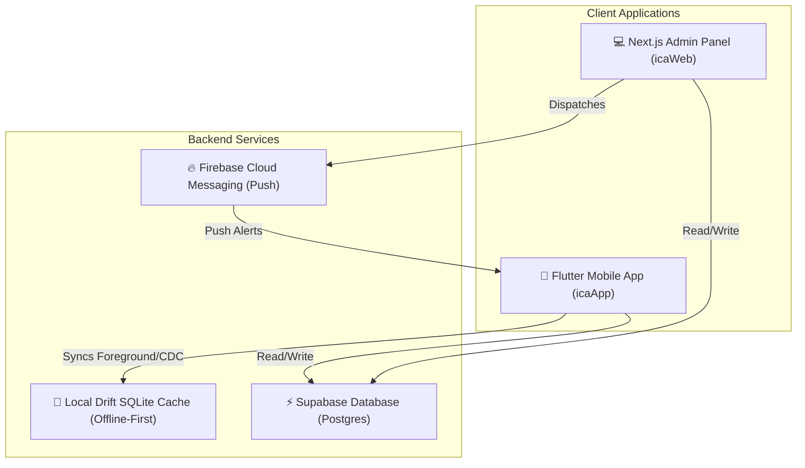

# 🏆 Indian Chess Academy (ICA) — Unified Workspace Monorepo

Welcome to the unified monorepo for the **Indian Chess Academy (ICA)**. This repository houses both the administrative web portal and the parent/student mobile applications, backed by a real-time synchronized database.

---

## 🏛️ System Architecture

The Indian Chess Academy ecosystem consists of two front-ends sharing a single **Supabase PostgreSQL** backend database with Realtime Change Data Capture (CDC):



---

## 📂 Project Subdirectories

The workspace is divided into two main folders:

1.  **[icaWeb](file:///x:/X/ICA/icaWeb)**: The web administration portal. Built with **Next.js 14 (App Router, TypeScript)**, **Tailwind CSS**, and the **Supabase JS SDK**. It allows academy coaches and administrators to manage classes, mark attendance, track geofence logs, upload study materials, broadcast notifications, and review billing subscriptions.
    *   *Read more in the* [icaWeb/README.md](file:///x:/X/ICA/icaWeb/README.md).
2.  **[icaApp](file:///x:/X/ICA/icaApp)**: The parent and student mobile applications. Built with **Flutter**, **GetX (State/Routing)**, **Drift (Offline Local SQL SQLite Cache)**, **Firebase Cloud Messaging (FCM)**, **Biometrics**, and **Dio (Certificate Pinning)**. It features separate views for students (check-in, worksheets, group chat, live polls) and parents (attendance logs, child profiles, trial bookings, subscription checkouts).
    *   *Read more in the* [icaApp/README.md](file:///x:/X/ICA/icaApp/README.md).

---

## 📊 Core Feature Matrix

| Feature Module | Web Panel ([icaWeb](file:///x:/X/ICA/icaWeb)) | Mobile App ([icaApp](file:///x:/X/ICA/icaApp)) | Sharing Mechanism & Realtime CDC |
| :--- | :--- | :--- | :--- |
| **Authentication** | Custom Email/Password login bypass | Email login + Biometric check | Supabase Auth (Shared users instance) |
| **Batch Scheduling** | Admin batch creation & scheduling calendar | Read-only calendar events stream | Realtime channels sync changes |
| **Student Profiles** | Student roster & linking to parent profiles | Context switcher for multiple children | `students` table queries |
| **Attendance Logs** | Batch attendance grids & check-in validations | List attendance history logs | Triggers update `attendance_records` |
| **Geofenced Check-in**| Configures coordinates & logs check-in audits | Geo check-in at Parul University | Verified status saved in database |
| **Worksheets & Materials**| Admin PDF uploads & Lichess share-links | Material viewer & downloader | Storage buckets & metadata tables |
| **Homework Desk** | Reviews and grades submissions | Uploads homework Drive links | Realtime updates on submit status |
| **Group Chat & Polls**| Creates polls & monitors community messages | Posts in chats and votes in active polls | CDC subscriptions for live feed updates |
| **Subscription Billing**| Tier settings & payment history dashboards | Biometric-secured checkout simulation | `plans` & `subscriptions` table lookups |
| **Notification Center**| Broadcasts alerts (FCM HTTP v1 dispatches) | Push notifications & local SQLite inbox | FCM service + SQLite `CachedNotifications` |

---

## ⚡ Quick Start Guide

### 1. Database Setup
The database schema and seeds are shared between both applications.
1. Create a project in your **Supabase Dashboard**.
2. Run the initialization script in the SQL editor: [20260612_init.sql](file:///x:/X/ICA/icaWeb/supabase/migrations/20260612_init.sql)
3. Seed the sample dataset: [20260612_seed.sql](file:///x:/X/ICA/icaWeb/supabase/migrations/20260612_seed.sql)
4. Update the schema for Round 2 additions: [20260620_round2.sql](file:///x:/X/ICA/icaWeb/supabase/migrations/20260620_round2.sql)
5. Configure checkin RLS policies: [20260701_checkin_policies.sql](file:///x:/X/ICA/icaWeb/supabase/migrations/20260701_checkin_policies.sql)

### 2. Run the Web Workspace
```bash
cd icaWeb
npm install
cp .env.example .env.local  # Configure Supabase URLs & FCM Service account keys
npm run dev
```
Open your browser at [http://localhost:3000](http://localhost:3000).

### 3. Run the Mobile Workspace
```bash
cd icaApp
flutter pub get
dart run build_runner build --delete-conflicting-outputs # Compile SQLite database
cp .env.example .env                                     # Add your backend keys
flutter run
```

---

## 🔒 Security & Geofence Bounds
*   **Geofencing coordinates**: Set by default to **Parul University, Vadodara** (`22.2678` N, `73.1433` E) with a radius of `200m`.
*   **Mobile App Protection**:
    *   *Certificate Pinning*: Custom SHA-256 Dio adapter targeting Supabase servers.
    *   *Screen Capture Protection*: Prevent screenshots (`FLAG_SECURE` in Android native layer).
    *   *Root/Jailbreak Detection*: Blocks execution in production mode.
    *   *Secure Storage*: Sensitive tokens are stored in the hardware-backed Android Keystore.
    *   *Idle Session Timeout*: Auto signs-out the user after 15 minutes of inactivity.

---

## 🔑 Evaluator Test Accounts
To bypass email verification triggers, log in using the pre-seeded account:
*   **Email**: `admin@ica.com`
*   **Password**: `AdminChess123!`
*   *Note: Logging into the mobile application with this account automatically links you to the Rajesh Kumar parent environment containing seeded students Aarav and Rohan Kumar.*
